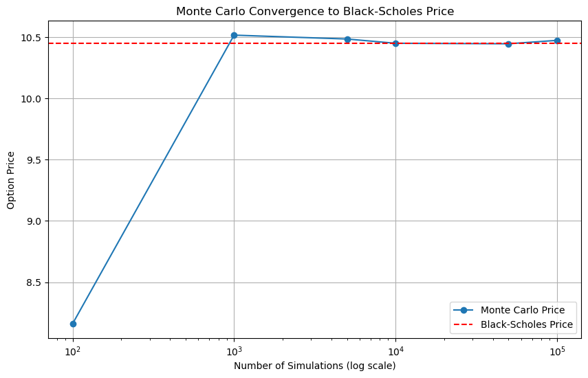
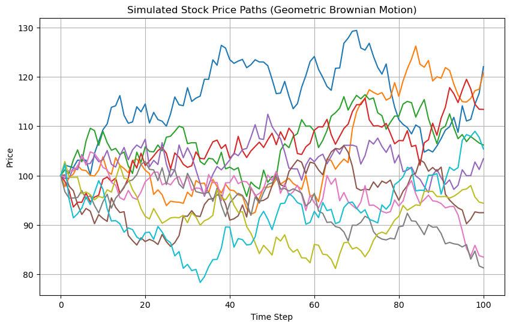

# European Option Pricing with Black-Scholes

This project implements the Black-Scholes formula in Python to compute the theoretical price of European call and put options.

## Project Highlights

- Implemented Black-Scholes and Monte Carlo simulations from scratch in Python
- Visualized stock price simulations using Geometric Brownian Motion
- Compared analytical and simulation-based pricing results

### Visuals

#### Monte Carlo Convergence to Black-Scholes

#### Simulated Stock Price Paths

## Model Overview

We use the Black-Scholes closed-form solution:

- Call option: C = S N(d1) - K e^(-rT) N(d2)
- Put option: P = K e^(-rT) N(-d2) - S N(-d1)

Where:
- S = current stock price
- K = strike price
- T = time to maturity (in years)
- r = risk-free interest rate
- σ = volatility
- N = standard normal cumulative distribution

## Inputs and Example

S = 100      # stock price
K = 100      # strike price
T = 1        # time to maturity (1 year)
r = 0.05     # risk-free rate (5%)
sigma = 0.2  # volatility (20%)

Output:

Call Price ≈ $10.45
Put Price ≈ $5.57

## Monte Carlo Simulation for European Call Option

Monte Carlo simulation estimates the option price by simulating many possible future stock prices under the assumption of geometric Brownian motion:

- S_T = S_0 * exp( (r - 0.5 * sigma^2) * T + sigma * sqrt(T) * Z )

where:

- S_T = simulated stock price at time T (maturity)
- S_0 = current stock price
- r = risk-free interest rate
- sigma = volatility of the stock
- T = time to maturity (in years)
- Z = a random number drawn from a standard normal distribution (mean 0, std dev 1)

The call option payoff is calculated as:

- payoff = max(S_T - K, 0)

The option price is then calculated as the discounted average of these payoffs over many simulated price paths:

- Option Price ≈ exp(-r * T) * average(payoff)

### Example Output

- Monte Carlo Call Price ≈ $10.47 (close to Black-Scholes analytical price)
